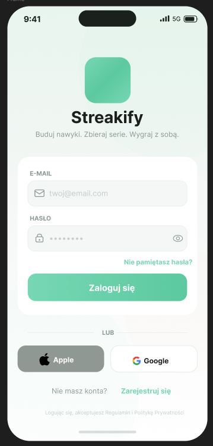
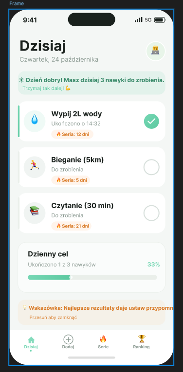
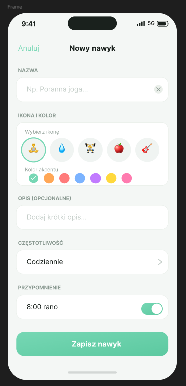
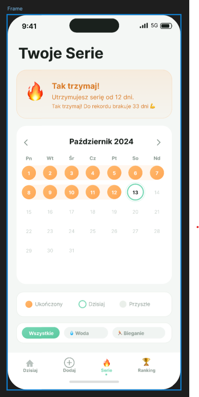
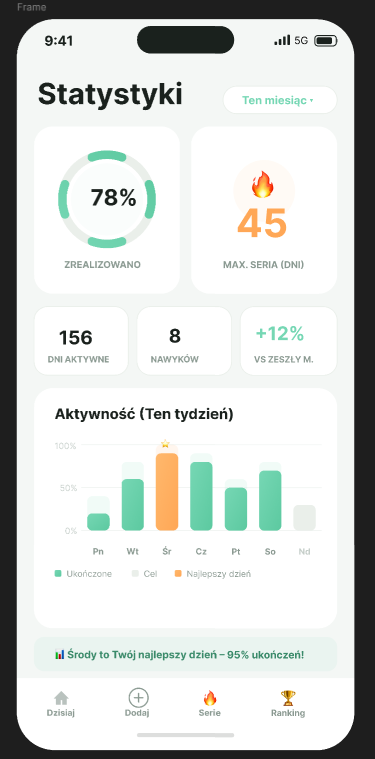
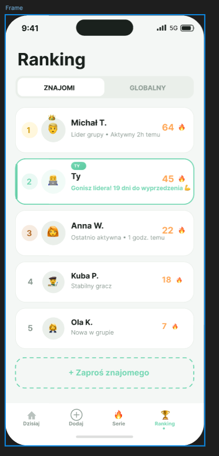

# Streakify

Projekt interfejsu aplikacji na iOS do budowania nawyków. Pomysł jest prosty: każdy nawyk ma
swoją serię dni, a żeby było trudniej odpuścić, można porównywać się ze znajomymi w rankingu.

Na razie istnieją makiety w Figmie, bez kodu. Aplikację planuję napisać w Swifcie.

  
  
  
  
  
  

## Co jest zaprojektowane

- **Ekran główny** z listą nawyków na dziś, szybkim odhaczaniem i paskiem dziennego celu.
- **Dodawanie nawyku**: nazwa, ikona, kolor, dzienny cel (np. 2 l wody, 5 km biegu)
  i opcjonalne przypomnienie.
- **Seria** w formie kalendarza z zaznaczonymi dniami i przerwami.
- **Statystyki**: procent wykonania, najdłuższa seria, liczba aktywnych dni i tygodniowy wykres.
- **Ranking** ze znajomymi zapraszanymi przez kod.

Założenia na implementację: dane trzymane lokalnie, żeby aplikacja działała offline,
powiadomienia z przypomnieniami oraz jasny i ciemny motyw zgodny z systemem.

## Licencja

MIT
